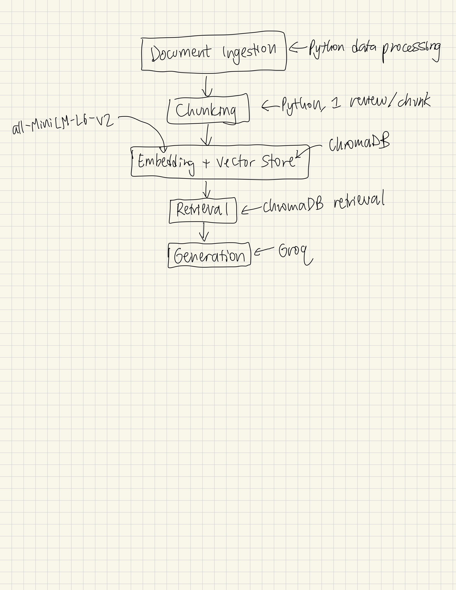

# Project 1 Planning: The Unofficial Guide

> Write this document before you write any pipeline code.
> Your spec and architecture diagram are what you'll use to direct AI tools (Claude, Copilot, etc.) to generate your implementation — the more specific they are, the more useful the generated code will be.
> Update the Retrieval Approach and Chunking Strategy sections if you change your approach during implementation.
> Update this file before starting any stretch features.

---

## Domain

<!-- What domain did you choose? Why is this knowledge valuable and hard to find through official channels? -->

Student reviews of CS professors at Georgia Institute of Technology - useful because official course descriptions don't reflect teaching style, exam difficulty, or workload. Student reviews are oftentimes more realistic and up to date as well.

---

## Documents

<!-- List your specific sources: URLs, subreddit names, forum threads, or file descriptions.
     Aim for at least 10 sources that together cover different subtopics or perspectives within your domain. -->

| # | Source | Type | URL or file path |
|---|--------|------|-----------------|
| 1 | Rate My Professor | Webpage Review | https://www.ratemyprofessors.com/professor/2996586 |
| 2 | Rate My Professor | Webpage Review | https://www.ratemyprofessors.com/professor/2267953 |
| 3 | Rate My Professor | Webpage Review | https://www.ratemyprofessors.com/professor/1347181 |
| 4 | Rate My Professor | Webpage Review | https://www.ratemyprofessors.com/professor/2352927 |
| 5 | Rate My Professor | Webpage Review | https://www.ratemyprofessors.com/professor/1206421 |
| 6 | Rate My Professor | Webpage Review | https://www.ratemyprofessors.com/professor/2945001 |
| 7 | Rate My Professor | Webpage Review | https://www.ratemyprofessors.com/professor/2251818 |
| 8 | Rate My Professor | Webpage Review | https://www.ratemyprofessors.com/professor/906485 |
| 9 | Rate My Professor | Webpage Review | https://www.ratemyprofessors.com/professor/2418017 |
| 10 | Rate My Professor | Webpage Review | https://www.ratemyprofessors.com/professor/2150658 |

---

## Chunking Strategy

<!-- How will you split documents into chunks?
     State your chunk size (in tokens or characters), overlap size, and explain why those
     numbers fit the structure of your documents.
     A review-heavy corpus warrants different chunking than a long FAQ. -->

**Chunk size:**
A review size long (about 20 - 500 characters)

**Overlap:**
0 characters

**Reasoning:**
The rate my professor page is clearly structurally and semantically split by different students' reviews. Since each review only makes sense within its context, the chunks should be split based on each review's size rather than a fixed number. Having overlap wouldn't really mean anything here since each review is disjoint (from separate people).

---

## Retrieval Approach

<!-- Which embedding model are you using (e.g., all-MiniLM-L6-v2 via sentence-transformers)?
     How many chunks will you retrieve per query (top-k)?
     If you were deploying this for real users and cost wasn't a constraint, what tradeoffs
     would you weigh in choosing a different embedding model — context length, multilingual
     support, accuracy on domain-specific text, latency? -->

**Embedding model:**
all-MiniLM-L6-v2 via sentence-transformers

**Top-k:** 
5 chunks

**Production tradeoff reflection:** 
Larger models may be more accurate in the distance between different vector embeddings, but they require more time to store these embeddings and retrieve from them. Larger models also require more storage.
---

## Evaluation Plan

<!-- List your 5 test questions with their expected correct answers.
     Questions should be specific enough that you can judge whether the system's response
     is right or wrong. "What are good dining halls?" is too vague.
     "What do students say about wait times at [dining hall name] during lunch?" is testable. -->

| # | Question | Expected answer |
|---|----------|-----------------|
| 1 | Do students report that attendance is required for Professor David Joyner's courses? | Attendance is not required |
| 2 | What is the typical course assignment structure of CS3451 taught by Bo Zhu? | 8 programming assignments and 2 quizzes |
| 3 | What teaching qualities to students praise about Mark Moss? | Great lecturer, funny, cares about his students |
| 4 | What are some concepts I should be prepared for before taking CS3630 with Sonia Chernova? | Robotics, probability and statistics, math |
| 5 | What are some criticisms about Will Perkins' lectures / teaching style? | Bad handwriting that's hard to decipher, trouble explaining concepts to students, not enough resources outside class |

---

## Anticipated Challenges

<!-- What could go wrong? Name at least two specific risks with reasoning.
     Consider: noisy or inconsistent documents, missing source attribution, off-topic
     retrieval, chunks that split key information across boundaries. -->

1. Not enough chunks to provide enough context for generation for a specific query (some professors may not have many reviews).

2. Inconsistency in responses (some people have different opinions compared with others about professors).

---

## Architecture

<!-- Draw a diagram of your pipeline showing the five stages:
     Document Ingestion → Chunking → Embedding + Vector Store → Retrieval → Generation
     Label each stage with the tool or library you're using.
     You can use ASCII art, a Mermaid diagram, or embed a sketch as an image.
     You'll use this diagram as context when prompting AI tools to implement each stage. -->

---

## AI Tool Plan

<!-- For each part of the pipeline below, describe:
     - Which AI tool you plan to use (Claude, Copilot, ChatGPT, etc.)
     - What you'll give it as input (which sections of this planning.md, which requirements)
     - What you expect it to produce
     - How you'll verify the output matches your spec

     "I'll use AI to help me code" is not a plan.
     "I'll give Claude my Chunking Strategy section and ask it to implement chunk_text()
     with my specified chunk size and overlap" is a plan. -->

**Milestone 3 — Ingestion and chunking:**
I will give the domain, documents, and chunking sections to Claude to preprocess the documents and split them into review chunks and have it write tests to ensure the output is the same as my intention.

**Milestone 4 — Embedding and retrieval:**
I will use Claude to pass in the chunks from Milestone 3 and embed it into ChromaDB and retrieve from it.

**Milestone 5 — Generation and interface:**
I will use Claude to pull from Groq and retrieved chunks to answer the user's query.